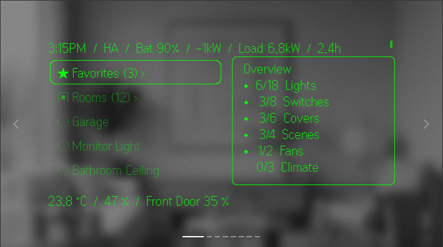
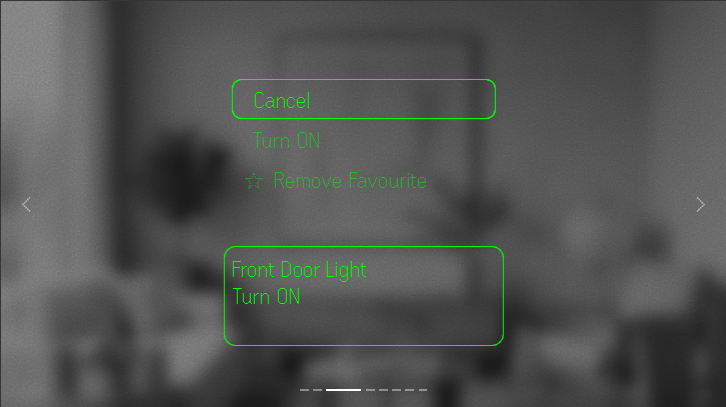
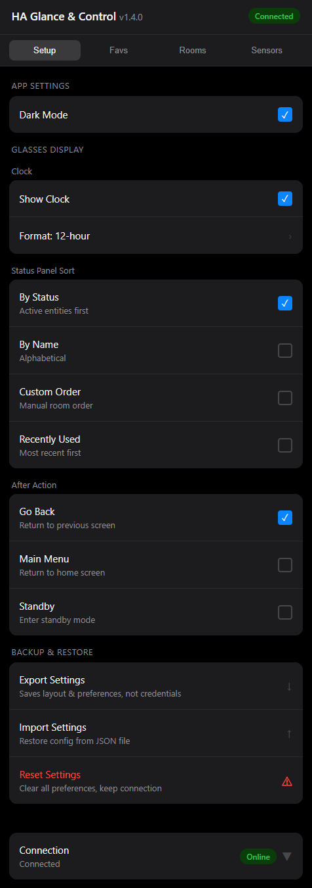
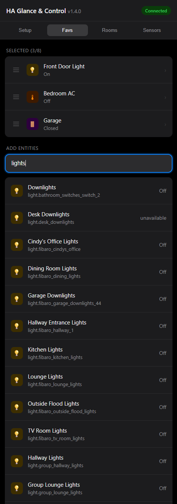
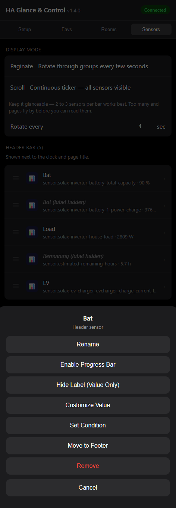

# HA Glance & Control

**Home Assistant sensor monitoring and smart home control for Even Realities G2 smart glasses.**

Monitor your home at a glance and control lights, switches, covers, locks, and climate — without touching your phone.

<p align="center">
  
  &nbsp;
  
</p>
<p align="center">
  
</p>

---

## What It Does

Your G2 glasses become a live window into your smart home. Sensor values scroll across your field of view. When you need to act, a single ring tap opens room-based controls. Done in seconds, back to what you were doing.

---

## Features

### Glance — Live Sensor Monitoring
- **Header and footer sensor panels** display live entity values from Home Assistant
- **Pagination** auto-rotates through sensors every N seconds (configurable)
- **Scroll mode** horizontally tickers through all sensors continuously
- **Conditional display** — show a sensor only when it meets a condition, e.g. garage door only when open
- **Sensor customisation** per slot:
  - Rename the label
  - Apply a divisor (e.g. W → kW)
  - Override the unit string (e.g. show `!` as a warning symbol)
  - Hide the label to save space
- **Clock** in the header, 12h or 24h, toggleable

### Control — Room-Based Entity Control
- Navigate by **Home Assistant area** using the ring controller
- Supported domains: lights (toggle + brightness), switches, covers, locks, climate
- **Favourites panel** for instant access to your most-used entities
- **Recently used** rooms and entities surfaced automatically
- **Post-action destination** — choose to return to the room, home screen, or standby after acting

### Standby Mode
- Clock and sensor panels stay active when the glasses are idle
- Ring controller still responds — tap to wake into the full interface

### Settings (Phone)

<p align="center">
  
  &nbsp;
  
  &nbsp;
  
</p>

- Full configuration from the Even Hub phone app
- Search entities across all supported domains
- Drag to reorder sensors, rooms, and favourites
- Per-sensor customisation dialog
- Pagination interval and scroll mode toggle
- Custom names applied consistently across the HUD and settings UI

---

## Requirements

- Even Realities G2 glasses with Even Hub app
- Running Home Assistant instance
- Long-lived access token — [how to generate one](https://www.home-assistant.io/docs/authentication/#your-account-profile)

---

## Installation

Search **HA Glance & Control** in the Even Hub app store.

---

## Setup

1. Open Even Hub and launch **HA Glance & Control**
2. Tap the settings icon
3. Enter your Home Assistant URL — Nabu Casa (`https://yourinstance.ui.nabu.casa`) or local (`http://homeassistant.local:8123`)
4. Enter your long-lived access token
5. Add sensors to the header/footer panels and assign entities to rooms

---

## Development

Built with TypeScript and Vite, using the Even Realities Hub SDK.

```bash
npm install
npm run dev       # local dev server
npm run build     # production build
npm run pack      # build + package as .ehpk for Even Hub
```

---

## Contributing

Issues and PRs welcome. If you run into a bug or want support for a new domain or feature, open an issue.

---

## License

MIT
